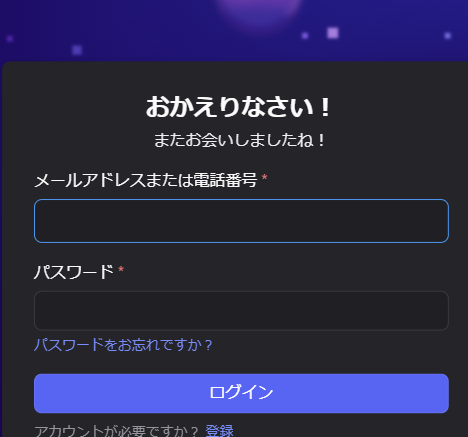
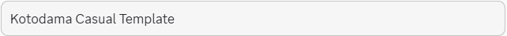
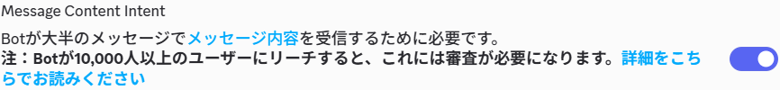
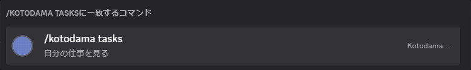

# 新しいBotを作って使い始める

この手順は、既存Botを流用せず、新しい専用Application/Botを作るためのものです。自動化できる準備を先に済ませ、本人のログイン・同意・確認が必要な画面で人へ渡します。

**ログインは必ず本人が行う手順です。** エージェントはログイン画面の準備と案内、完了後の状態確認を担当します。パスワード入力・ログイン確定・2FA・CAPTCHAは代行しません。一度ログインできたら、現在の認証状態を確認して後続の自動処理へ戻ります。同じ有効なログインを作業ごとに要求し直しません。

## 分担

| 工程 | 自動で行うこと | 人が行うこと |
|---|---|---|
| PC/サーバー準備 | 依存関係、設定の雛形、診断 | 使用するサーバーと操作者を決める |
| Developer Portal | ページを開き、現在の状態を確認する | ログイン・2FA・CAPTCHA |
| 新しいApplication | 名前を入力し、重複と対象を確認する | 要求される規約同意・最終作成操作 |
| Bot token | 保存先と診断を用意する | 生成時の本人確認、秘密をチャットに出さず保存する |
| 必要なアクセス | Message Content、用途に合う権限、招待URLを用意する | アクセス内容とサーバーを確認して認証する |
| 仕事の実行器 | Codex CLIと専用の認証保存先を準備・診断する | 必要時にCodexへログインする |
| 音声APIの利用準備 | 認証参照と利用枠を設定し、残高不足時は再試行を止める | 支払い・クレジット追加が必要な場合は本人が行う。完了後の再開確認はエージェントへ戻せる |
| 接続 | ID・guild・権限読戻し、コマンド登録、テキスト動作確認 | 結果を確かめる |
| 音声 | 指定した処理対象で両モードを接続し、停止・成果返却を確認する | 説明・同意確認は人間側の責任で扱い、Botから再確認を繰り返さない。実際の聞こえ方を確かめる |

## 1. Developer Portalへ本人がログインする

普段のブラウザですでにログインしている場合は、その有効なログインを保ち、対象のDeveloper Portalアカウントで次へ進みます。本人がブラウザで必要な設定を行い、エージェントはCLIの診断と設定ファイルの準備を担当します。



## 2. ApplicationとBotを作る

[Discord Developer Portal](https://discord.com/developers/applications)で、新しいApplicationを作ります。名前の例は「Kotodama Casual Template」です。アプリ名に「Discord」を含めると拒否されるため、この単語を名前へ入れません。同じ名前の既存Applicationがあっても、それを新しいBotと取り違えません。作成後のApplication IDとBot IDを読み戻します。



BotページでMessage Contentを有効にします。Bot tokenの生成・再生成には本人確認が求められることがあります。Tokenを画面のスクリーンショット、チャット、Git、コマンド引数へ入れないでください。



Tokenは本人のターミナルで次のコマンドを実行し、非表示入力へ貼り付けます。指定した新しいApplicationと一致することを確認してから、Gitに含まれないファイルへ保存します。

```sh
python tools/save_discord_token.py --app YOUR_NEW_APPLICATION_ID
```

保存後のコマンドでは `--env-file=.kotodama/secrets/discord.env` を使えます。Token自体を引数へ渡しません。

## 3. 対象固定の招待を作る

```sh
node tools/discord-setup.mjs invite --app YOUR_NEW_APPLICATION_ID --guild YOUR_GUILD_ID
```

`bot`と`applications.commands`、必要な閲覧・履歴・送信・添付・音声権限だけを指定します。Administratorは要求しません。最終認証はサーバーの管理権限を持つ人が行います。

先に設定を作り、Application ID・自分のID・受付チャンネル・仕事の対象を入れます。既存設定がある場合は上書きせず、その設定へ新しいApplication IDを反映します。

```sh
node bin/kotodama.mjs init --app YOUR_NEW_APPLICATION_ID --guild YOUR_GUILD_ID --operator YOUR_USER_ID --channel YOUR_TEXT_CHANNEL_ID --workspace /path/to/your/repository
```

## 4. 仕事を実行するCodex CLIへログインする

DiscordのBot認証と、仕事を実行するCodex CLIの認証は別です。既存ログインが有効なら再利用します。401や `CODEX_LOGIN_REQUIRED` が出た場合は、自動でログインを繰り返さず、本人が認証します。

専用の認証保存先を使う場合は、private設定の `analyzer.codexHome` と `worker.codexHome` に同じprivate directoryを指定し、本人のターミナルで次を実行します。

```sh
node tools/codex-login.mjs --config .kotodama/config.json
```

表示されたURLを本人が開き、本人がコードを入力します。エージェントはその操作を代行せず、完了後に実際のモデル応答まで確認します。音声APIの認証・利用上限も別途設定します。[公式の認証手順](https://learn.chatgpt.com/docs/auth#login-on-headless-devices)。

## 5. 接続を確認する


```sh
node --env-file=.kotodama/secrets/discord.env tools/discord-setup.mjs verify --app YOUR_NEW_APPLICATION_ID --guild YOUR_GUILD_ID --output .kotodama/discord-setup-receipt.json
node --env-file=.kotodama/secrets/discord.env bin/kotodama.mjs doctor
node --env-file=.kotodama/secrets/discord.env bin/kotodama.mjs register
node --env-file=.kotodama/secrets/discord.env bin/kotodama.mjs start
```



`verify`は読み取りだけです。成功しても投稿・音声接続・実際の利用が完了したとは表示しません。テキストで一つ依頼し、成果が返るところまで確認してから音声を試します。

## 6. 音声を使い始める

管理者がprivate設定へVC、`voice.participantIds`、音声APIの認証参照、利用上限を設定します。既定の `voice.consentMode=owner_managed` では、プライバシーの説明・同意確認は人間側が責任を持ち、Botの同意クリックは必須にしません。処理記録はowner管理の対象として残し、参加者本人のクリック記録を作ったことにはしません。本人が `/kotodama consent` から停止を申し出た場合は尊重します。

参加者クリックを使う運用だけ `participant_opt_in` を選べます。ログイン・2FAなどの本人認証とは別の区分です。

音声APIの環境変数を別ファイルへ保存した場合は、起動時に両方を読み込みます。値はチャットやGitへ入れません。

```sh
node --env-file=.kotodama/secrets/discord.env --env-file=.kotodama/secrets/voice.env bin/kotodama.mjs start
```

操作者の `/kotodama voice join` で接続します。聞き役は `assist`、発話しない議事録は `minutes` です。音声の処理対象であることは、開発・ツール操作の権限を追加しません。

## スクリーンショットについて

手順の画面は実際に確認した安全な領域だけを採用します。Tokenや本人情報が見える画面は保存しません。未確認の画面を生成画像で補って、作成済みと表示しません。画面資料の取得状況はこの手順の更新時に記録します。

公式資料：[最初のDiscord Bot](https://docs.discord.com/developers/quick-start/getting-started)。Portalの表示が変わった場合は現在の画面を読み直します。

## GPT-Live自然会話を試す設定例

`init`で生成した `.kotodama/config.json` の既存項目を保ち、以下をマージします。IDは自分のDiscordの値へ置き換えてください。既定のLive transcriptを使うため、リアルタイム用ローカルASRは不要です。この断片だけでは完全な設定ファイルではありません。

```json
{
  "discord": { "voiceChannelId": "YOUR_VOICE_CHANNEL_ID" },
  "voice": {
    "mode": "assist",
    "autoJoin": true,
    "participantIds": ["YOUR_USER_ID"],
    "transcriptSource": "live",
    "naturalConversation": true,
    "maxSessionSeconds": 300,
    "maxDailyAudioSeconds": 600,
    "maxTotalAudioSeconds": 600,
    "storeAudio": false
  }
}
```

| 設定 | 変わること |
|---|---|
| `discord.voiceChannelId` | 入るVCを一つに固定 |
| `voice.autoJoin` | 対象者がいると入室、無人時に退出。手動停止と対象外参加者の条件は維持 |
| `voice.participantIds` | 処理を許可した人。操作者は別途 `discord.operators` に設定 |
| `voice.transcriptSource` | `live`（既定）はGPT-Liveを発話開始時に開く。`local` は確定入力と呼びかけ検出をローカルASRで行う |
| `voice.conversationStart` | ローカルASR時、`speech` は操作者の発話検出、`wake` は呼び名の認識でLiveを開始 |
| `voice.naturalConversation` | `true`（既定）はLive＋Responsesの自然会話、`false` は確定テキストを待つ方式 |
| `voice.maxSessionSeconds` / `maxDailyAudioSeconds` / `maxTotalAudioSeconds` | 1接続／1日／累計の音声秒数上限。上記は初回試験用の小さい枠 |
| `voice.outputPrefillMs` / `maxOutputQueueMs` | 出力を蓄える時間／未再生queueの上限。既定120ms／500ms。小さくすれば必ず改善するわけではない |
| `voice.storeAudio` / `archive` | 原音保存は明示設定。[保存接続](ARCHIVE-RUNTIME.md)には別途encoder・保存先・保持方針が必要 |

## 録音とOpenAI Whisper全文文字起こしの設定例

Live会話の設定を保ったまま、絶対path・ID・保持policyを自分のprivate実行ホストへ合わせて追加します。`archiveRoot` は既存ディレクトリ、`journalPath` は `dataDir` 内に置きます。

```json
{
  "dataDir": "/absolute/private/kotodama-data",
  "agentBinding": { "agentId": "voice-agent", "vmId": "voice-vm" },
  "voice": { "storeAudio": true },
  "archive": {
    "enabled": true,
    "archiveRoot": "/absolute/private/kotodama-recordings",
    "journalPath": "/absolute/private/kotodama-data/archive.sqlite",
    "retentionPolicyRef": "my-voice-retention-policy",
    "sourceRef": "my-discord-vc",
    "actorId": "YOUR_USER_ID",
    "readers": ["YOUR_USER_ID"],
    "captureAssistantAudio": true,
    "assistantSpeakerId": "kotodama-assistant",
    "whisperProtocol": "openai",
    "whisperEndpoint": "https://api.openai.com/v1/audio/transcriptions",
    "whisperModel": "whisper-1",
    "whisperApiKeyEnv": "OPENAI_API_KEY"
  }
}
```

ローカルWhisperを使う場合は `whisperProtocol` を `local`、`whisperEndpoint` をloopback/private LAN/tailnet内の互換endpointへ変更し、`whisperApiKeyEnv` は削除します。参加者track、mixed、Whisper原文、時系列の訂正文が保存されます。上の例のように `captureAssistantAudio: true` を明示した場合は、GPT-Live assistant trackも保存されます。後処理済みの全文は `export-transcript` で一つのファイルへ出力できます。

自然会話内のbackendは現在 `gpt-5.6-luna`、low reasoning、出力800tokenに固定です。別経路の `analyzer.model` や `analyzer.maxOutputTokens` を変更してもこの値は変わりません。GPT-Live 1とLunaの利用権限を持つ `OPENAI_API_KEY` を実行ホストへ用意します。APIキーは付属しません。

[公式モデル資料](https://developers.openai.com/api/docs/models/gpt-live-1)ではLiveの接続時間とbackendモデル・tool利用は別課金です。秒数上限は全API費用の金額上限ではありません。ローカルASRの負荷も監視してください。`naturalConversation: true` は短い無言では切断せず、終了tool・手動退出・接続/利用上限で閉じます。

設定後に `doctor`、`register`、`start` を上記の方法で実行します。対象VCで挨拶し、その返答後に呼び名なしで質問を続けてください。続いて割り込みと `voice leave` を確認します。始まらなければ `voice` コマンドの `mode:start_conversation` を選び、`status` で参加者・手動停止・上限を確認します。API応答、Discord再生、人の実聴を分け、別環境での再現は[受入表](ACCEPTANCE.md)の未受入項目を埋める必要があります。
